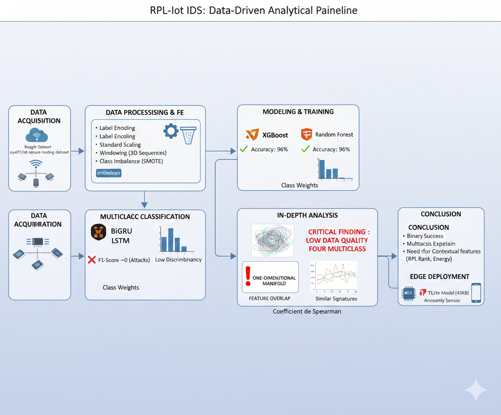
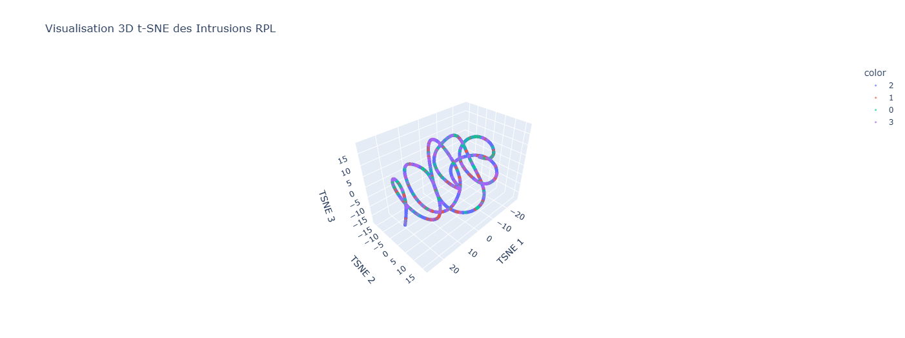

# 🛡️ IoT-IDS: Forensic Data Analysis & Intrusion Detection in RPL Networks

[](https://www.kaggle.com/datasets/ziya07/iot-secure-routing-dataset-for-intrusion-detection)
[](https://www.python.org/)
[](#)
[](#)

## 📌 1. Project Overview
This project focuses on the development of an Intrusion Detection System (IDS) for **RPL-based IoT networks**. Using a combination of Machine Learning (XGBoost, Random Forest) and Deep Learning (BiGRU, LSTM), this study evaluates the ability to detect malicious routing behavior.

The project highlights a critical discovery in IoT security: the distinction between **Anomaly Detection** (Binary) and **Attack Identification** (Multiclass), providing a deep dive into data quality and feature discriminancy.

---

## ⚙️ 2. Analytical Pipeline
The project follows a rigorous end-to-end workflow designed for constrained IoT environments:


1.  **Data Ingestion:** Processing the *IoT Secure Routing Dataset* from Kaggle.
2.  **Preprocessing:** Robust scaling and Label Encoding of network headers.
3.  **Exploratory Data Analysis (EDA):** Statistical auditing of packet-level distributions.
4.  **Forensic Visualization:** Dimensionality reduction using **t-SNE (2D & 3D)**.
5.  **Modeling:** Benchmarking Gradient Boosting vs Random Forest .
6.  **Edge Optimization:** Model quantization for **TensorFlow Lite** deployment.


---

## 🔍 3. Data Quality & The "Spiral" Manifold
A significant portion of this research is dedicated to **Data Quality Assessment**. 

### The Challenge: Feature Overlap
The 3D t-SNE visualization revealed a critical structural property of the dataset:
> *"The 3D t-SNE visualization reveals a **one-dimensional manifold structure (a spiral)**. Malicious activities do not form distinct clusters but are embedded within the normal traffic flow. This indicates a high feature overlap, proving that network-level metrics alone are insufficient to distinguish between RPL attack types without additional contextual or topological features."*




### Simulation Artifacts
The "snake-like" shape is a signature of datasets generated via **simulators (like Cooja or NS3)**. In these environments, variables are often too "mathematically perfect," lacking the organic dispersion caused by real-world radio noise, obstacles, and hardware interference. This creates a scenario where attacks follow the exact statistical trajectory of normal traffic, making them "invisible" to multiclass classifiers without contextual features like **RPL Rank** or **Energy Consumption**.

---

## ⚔️ 4. Threat Model: Attack Definitions
* **Blackhole Attack:** A malicious node attracts traffic by claiming the shortest path, then drops all incoming packets.
* **Replay Attack:** Capturing legitimate traffic and re-transmitting it to saturate the network or desynchronize nodes.
* **Packet Drop (Selective Forwarding):** A stealthy attack where specific packets are dropped to degrade performance while avoiding detection.

---

## 📈 5. Benchmarking Results

### ✅ Binary Classification (The Success)
Using **XGBoost**, the system proved to be a highly reliable **Anomaly Sensor**. It successfully identifies the presence of an intrusion with high precision.

**Overall Accuracy: 96.40%**
```text
Classification Report:
              precision    recall  f1-score   support

      Normal       0.96      1.00      0.98      2133
      Attack       1.00      0.75      0.86       367

    accuracy                           0.96      2500

## ⚠️ 5. Multiclass Classification: The Limitation
While anomaly detection is highly successful, the precise labeling of attack types (Multiclass) failed to reach the same level of accuracy. 

**Key Insights:**
* **Data Quality Issue:** This is not a model failure, but a fundamental limitation of the dataset's features.
* **Feature Overlap:** Without higher-layer features (e.g., node health, flow ratios), different attack types like *Blackhole* and *Packet Drop* are statistically indistinguishable within the t-SNE spiral.


---

## 💡 6. Conclusion
This project demonstrates that in **IoT Cybersecurity**, **Feature Engineering** is more critical than **Model Complexity**. 

* **Key Finding:** Network-layer metrics (Delay, Packet Size) are sufficient for **Detection** (Anomaly) but insufficient for **Diagnosis** (Attack Identification).
* **Future Work:** To "break" the 3D t-SNE spiral and improve classification, future iterations must integrate:
    1. **Flow-based metrics:** (e.g., Input/Output packet ratios).
    2. **Node health indicators:** (e.g., battery drain, CPU cycles).
    3. **Topological data:** (e.g., RPL Rank changes).


---

## 🛠️ 7. Installation & Usage

### 📋 Prerequisites
Ensure you have Python 3.8+ installed.

### 🚀 Setup
1. **Clone the repository:**
   ```bash
   git clone [https://github.com/hanane-lbg/RPL-IoT-IDS-Analysis.git](https://github.com/hanane-lbg/RPL-IoT-IDS-Analysis.git)
   cd iot-ids-rpl

2.**Install Dependencies:**
  ```bash
  pip install -r requirements.txt

3.**Run the Analysis:**
Launch the Jupyter Notebook to explore the EDA and model training:
